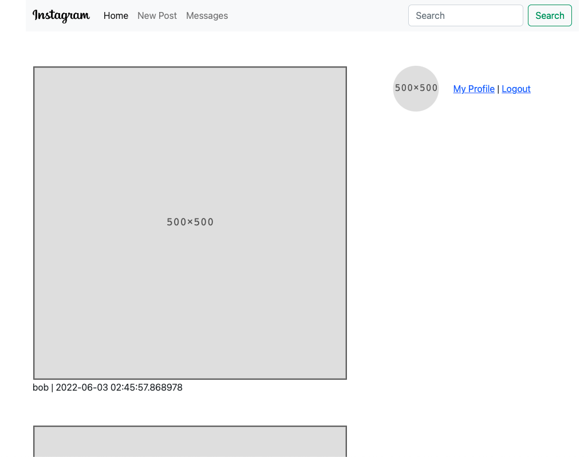
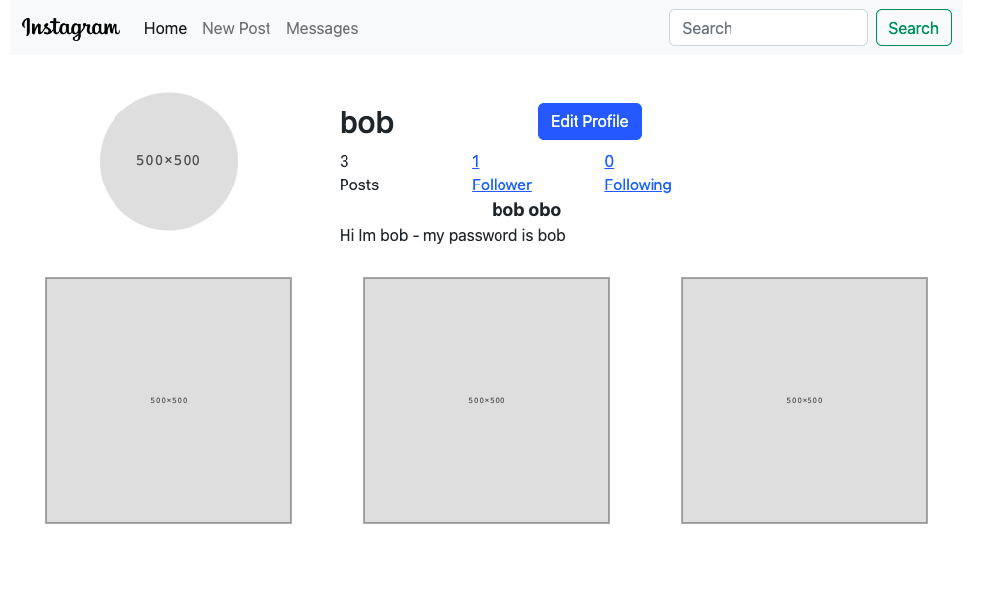
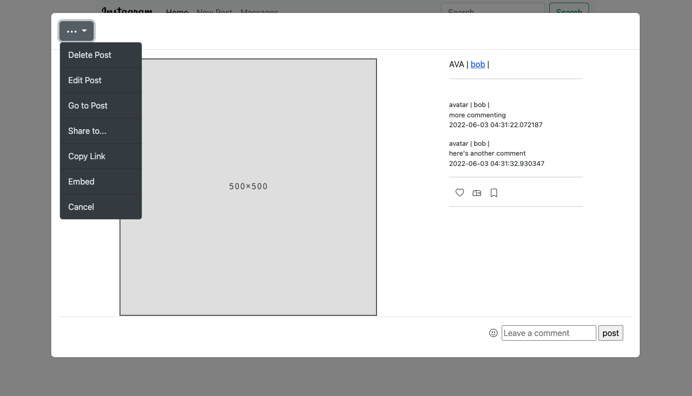

# INSTACLONE
A simplified clone of Instagram, built using Python, Flask, Bootstrap and SQLAlchemy





Currently you can create a new account, edit your account, create/edit/delete posts, follow users and comment on other users.  More instagram features to come: DM, Favorites, Bookmarks, Search

## How to install
```
git clone http://github.com/chinihy/instaclone.git
cd instaclone
pip install -r requirements.txt
```

## How to launch
Assuming you will want to use this app in developement mode, you can set it as an env variable
```
export FLASK_APP=main.py
export FLASK_ENV=development
flask run
```

Then open the following url in your browser
```
http://127.0.0.1:5000/
```

## Planned updates
- [ ] Messaging Feature
- [ ] Favorite and Bookmark features
- [ ] Search Feature
- [ ] More unit testing
- [ ] Upload user photo when you signup
- [ ] Cropping photos feature when you create a new post
- [ ] User avatars
- [ ] Minor style tweaks: Picture cropping/resizing, cleaning up CSS id/class naming
- [ ] Some modal transitions are limited by Bootstrap's Modal options, for example, leaving a comment currently takes you back to index, when it should just add the comment and leave the modal open. Still figuring out the best workaround for this.
- [ ] Sorting options/logic for home feed